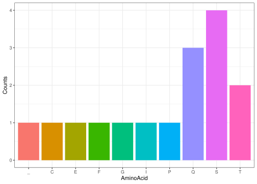

``` r
library(dogma)
```

## Package description

This package illustrates the central dogma of molecular biology by
generating random DNA sequences, transforming them into RNA, creating a
list of codons from the RNA sequence, translating the codons into the
protein sequence, and visualizing the counts of amino acids in the
protein.

## Function description

#### Function one (generate_dna):

Generates random DNA sequence given desired length.

``` r
set.seed(3)
generate_dna(10)
#> [1] "ATCGCTCGGC"
dna_seq <- generate_dna(50)
dna_seq
#> [1] "CTGCCCCATACAACAAACCTTCACCTCGTCGTGAGGTGAGTCTCAGTCAT"
```

#### Function two (from_T_to_U):

This function takes a DNA sequence and transforms it to RNA.

``` r
rna_seq <- dna_seq |> 
  from_T_to_U()
rna_seq
#> [1] "CUGCCCCAUACAACAAACCUUCACCUCGUCGUGAGGUGAGUCUCAGUCAU"
```

#### Function three (extract_codons):

The function takes a RNA sequence and creates a list of codons given the
start position.

``` r
codon_list <- rna_seq |> 
  extract_codons(start = 2)
codon_list
#>  [1] "UGC" "CCC" "AUA" "CAA" "CAA" "ACC" "UUC" "ACC" "UCG" "UCG" "UGA" "GGU"
#> [13] "GAG" "UCU" "CAG" "UCA"
```

#### Function four (RNA_to_protein):

This function takes codon lists and outputs amino acid sequence.

``` r
aa_seq <- codon_list |> 
  RNA_to_protein()
aa_seq
#> [1] "CPIQQTFTSS_GESQS"
```

#### Function five (aa_barplot):

This function takes amino acid sequence and creates a bar plot of
counts.

``` r
aa_seq |> 
  aa_barplot()
```

<!-- -->
